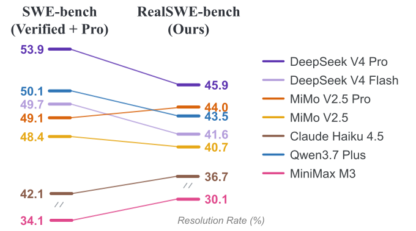

<div align="center">

## RealSWE: A Compositional Evaluation of Coding Agents<br>under Realistic User Requests

<a href="https://arxiv.org/abs/2608.27831"></a>
<a href="https://huggingface.co/papers/2608.27831"></a>
<a href="https://huggingface.co/datasets/gyuhyeong-k/RealSWE-bench"></a>
<a href="LICENSE"></a>

</div>

<p align="center">
  
</p>

Coding agents are commonly evaluated on SWE-bench-style benchmarks built from curated GitHub issues, which are detailed, well-structured, and long, whereas everyday user requests are short, informal, and sparse. RealSWE addresses this gap with 381 multi-variant task families derived from SWE-bench Verified and SWE-bench Pro. Each family shares the same underlying task and gold patch while varying information composition and linguistic style.

Evaluating seven LLMs with RealSWE shows that:

- Realistic inputs **reduce resolution rates by 6.4 pp on average** and **can change model rankings.**
- **_Desired Behavior_ and _Motivation_ significantly affect performance**, whereas **_Environment Information_ and _Reproduction Steps_ add tokens without measurable benefit.**
- Linguistic style has **only small, model-dependent effects**.

This repository provides two components:

- **RealSWE-bench**: a benchmark of 381 tasks whose information composition and linguistic style follow the distributions observed in real user requests from SWE-chat.
- **RealSWE-framework**: a tool for building custom benchmarks from the 381 task families by choosing the information composition and linguistic style.

## RealSWE-bench

The benchmark is available in [`RealSWE-bench/tasks.jsonl`](RealSWE-bench/tasks.jsonl) and on [`Hugging Face`](https://huggingface.co/datasets/gyuhyeong-k/RealSWE-bench):

```python
from datasets import load_dataset

ds = load_dataset("gyuhyeong-k/RealSWE-bench", split="train")
```

It contains 381 tasks, 192 bug fixes and 189 feature requests. See the [`dataset card`](https://huggingface.co/datasets/gyuhyeong-k/RealSWE-bench) for the data fields.

## RealSWE-framework

RealSWE-framework builds a benchmark from the 381 task families with the information composition and linguistic style you choose.

### Quick start

```bash
cd RealSWE-framework
pip install -e .

realswe construct \
  --name my-bench \
  --style paper-default \
  --bug PDREA \
  --feature PMA
```

`--style` sets the linguistic style, and `--bug` and `--feature` set the information composition of bug-fix and feature-request tasks. The benchmark is written to `benchmarks/my-bench/tasks.jsonl`. An existing benchmark is never overwritten, so use a new `--name` for each one.

### Information composition

A composition is a string of field letters, joined in the order given.

<table>
  <thead>
    <tr><th colspan="2">Bug fix</th><th colspan="2">Feature request</th></tr>
  </thead>
  <tbody>
    <tr><td><code>P</code></td><td>Problem Statement</td><td><code>P</code></td><td>Problem Statement</td></tr>
    <tr><td><code>D</code></td><td>Desired Behavior</td><td><code>M</code></td><td>Motivation</td></tr>
    <tr><td><code>R</code></td><td>Reproduction Steps</td><td><code>A</code></td><td>Additional Information</td></tr>
    <tr><td><code>E</code></td><td>Environment Information</td><td></td><td></td></tr>
    <tr><td><code>A</code></td><td>Additional Information</td><td></td><td></td></tr>
  </tbody>
</table>

```bash
realswe construct \
  --name pd-pm \
  --bug PD \
  --feature PM
```

To reproduce RealSWE-bench:

```bash
realswe construct --config construct-bench
```

### Linguistic style

`paper-default` is the style used in the paper and needs no API key.

To create a different style, give it a name and set four dimensions in [`configs/rephrase-example.yaml`](RealSWE-framework/configs/rephrase-example.yaml):

| Dimension | Values |
|---|---|
| `formality` | `casual`, `formal` |
| `sentence_type` | `imperative`, `declarative`, `interrogative` |
| `certainty` | `confident`, `uncertain` |
| `perspective` | `first_person`, `non_first_person` |

Each dimension also accepts `preserve`, which leaves it unchanged.

Set an OpenAI API key and rephrase the task families:

```bash
export OPENAI_API_KEY=<your-api-key>
realswe rephrase --config rephrase-example
```

Rephrasing makes one API call per task family, 381 in total. If a run is interrupted, run the same command again with `--resume`.

Then construct a benchmark by passing the style name to `--style`:

```bash
realswe construct \
  --name formal-bench \
  --style formal-declarative \
  --bug PDREA \
  --feature PMA
```

## Citation

```bibtex
@misc{kim2026realswecompositionalevaluationcoding,
      title={RealSWE: A Compositional Evaluation of Coding Agents under Realistic User Requests},
      author={Gyuhyeong Kim and Hyojung Gwon and Jeonghyeon Kim and Kyuhong Shim and Sunjae Lee},
      year={2026},
      eprint={2608.27831},
      archivePrefix={arXiv},
      primaryClass={cs.AI},
      url={https://arxiv.org/abs/2608.27831},
}
```
